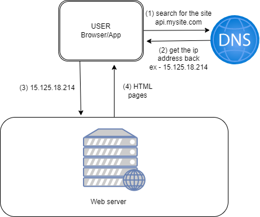
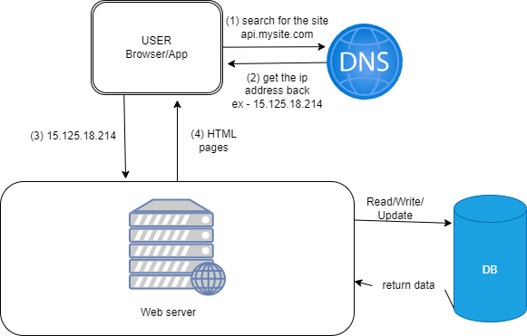
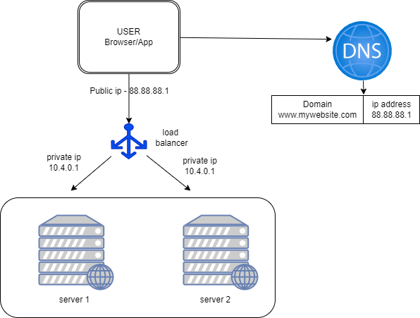
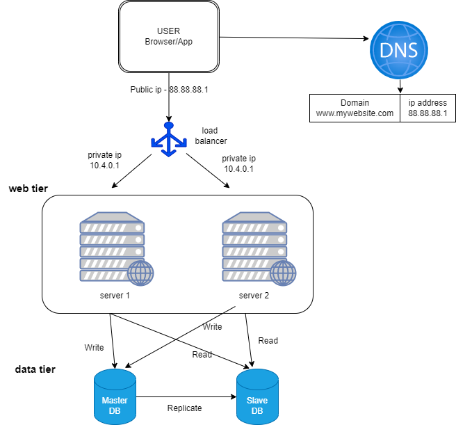
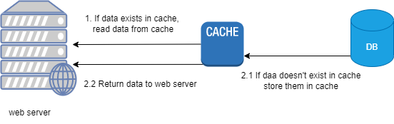

# **CHAPTER 1: Scale from zero to millions of users - notes**

Journey of a million users starts from one.

1. ### **Single server setup**

    This setup means everything is running on one server: web app, database, cache etc.

    

    Description -

    1. Users access websites through domain name. The domain nam goes to DNS to find the ip address
    2. IP address is returned to the browser or app.
    3. Once ip address is obtained HTTP requests are sent to web server. Example -The api endpoint is called from the frontend. It goes to the server to that endpoint.
    4. The web server returns HTML pages or JSON. The data is returned in the above query.

2. ### **Database**
   
   With the growth of user base, one server won't be enough and we need multiple server one for web/mobile traffic (web tier) and database (data tier) server allowed them to scale independently.

   

3. ### **Load Balancer**

    1. Just imagine, you have an advertisement by an influencer. Now your website suddenly increased ten-fold. If these many users are accessing the server simultaneously and it reaches the web server's load limit, user will experience slower response or fail to connect to the server.
    2. In another scenario, the server goes offline for some reason, user can't access the site.

    In any case you as founder don't need that. To address this problem, load balancer is the best technique.

    

    
    A load balancer is a device or software application that efficiently distributes incoming network traffic or workload across multiple servers. The primary purpose of a load balancer is to ensure that no single server becomes overwhelmed with too much traffic, optimizing resource utilization, maximizing throughput, and ensuring high availability and reliability of applications or websites.

    Here are some key functions and benefits of load balancers:

    1. Distribution of Traffic: Load balancers evenly distribute incoming requests among a group of servers, preventing any single server from becoming a bottleneck and ensuring that each server shares the load.

    2. High Availability: By distributing traffic across multiple servers, load balancers enhance the availability and reliability of applications. If one server fails, the load balancer redirects traffic to the remaining healthy servers, minimizing downtime.

    3. Scalability: Load balancing enables easy horizontal scaling. As traffic increases, additional servers can be added to the server pool, and the load balancer will distribute the workload accordingly.

    4. Improved Performance: Load balancers can optimize the use of server resources, preventing individual servers from being overwhelmed and maintaining consistent performance for end users.

    5. Session Persistence: Some load balancers support session persistence, ensuring that requests from a particular user are always directed to the same server. This is crucial for applications that require stateful connections, such as those with user sessions.

    6. Health Monitoring: Load balancers regularly check the health of servers by monitoring response times and other indicators. If a server becomes unresponsive or experiences issues, the load balancer can automatically redirect traffic away from that server.

    There are different types of load balancers, including hardware-based load balancers, software-based load balancers, and cloud-based load balancers. Additionally, load balancing can be implemented at various layers of the network stack, such as application-layer, transport-layer, or network-layer load balancing.

    In summary, load balancers play a critical role in optimizing the performance, availability, and scalability of applications by distributing incoming traffic across multiple servers. They are commonly used in web applications, cloud environments, and other scenarios where high availability and efficient resource utilization are essential.

    As shown in the figure,
    1. user connect to public ip address of the load balancer directly. With this setup the server is unreachable by the client.
    2. For better security, private ip are used between servers for communication.
    3. The load balancer communicate with he servers using these private ip's.

    If you remember the issue we discussed earlier in the starting of [Load Balancer](#load-balancer), is solved. Now no failover issue will be there.

    1. If server 1 goes offline, the load balancer will route the traffic to server 2. This will prevent the site to go offline. To resolute this problem quickly we can add another healthy server to the server pool to balance the load.
    2. Adding more server to the server pool will solve many issues when traffic increases. Load balancer will resolve all these issues gracefully.

4. ### **Database Replication**
   
   The above figure serves the purpose for the web tier. We have to think for the data tier as well.

   Database replication is a process that allows data to be copied, distributed, or synchronized across multiple databases. The primary goal of database replication is to enhance data availability, fault tolerance, and performance. It is commonly used in scenarios where high availability, disaster recovery, and improved read performance are essential.

    Here are some key concepts related to database replication:

    **Master-Slave Replication**:

    1. Master Database: The primary database that accepts write operations (insert, update, delete).
    2. Slave Database(s): Copies of the master database that replicate data from the master. They are read-only and used for read operations.
    
    **Replication Types**:

    1. Snapshot Replication: Periodically takes a snapshot of the entire database and replicates it to the target.
   
        Taking snapshots and replicating them periodically in Amazon RDS (Relational Database Service) for PostgreSQL involves using Amazon RDS automated backups and enabling replication features. Here are the steps to achieve snapshot replication for a PostgreSQL database in Amazon RDS:
        
        1. Enable Automated Backups:
        
            Amazon RDS provides automated backups that you can schedule. By default, automated backups are enabled when you create a new DB instance.

            To enable automated backups on an existing DB instance:

            1. Open the Amazon RDS console.
            2. Select the DB instance you want to enable automated backups for.
            3. Go to the "Configuration" tab.
            4. Under the "Backup" section, set the "Backup retention period" to the number of days you want to retain automated backups.
   
        2. Snapshot Replication:

            Automated backups in Amazon RDS are essentially snapshots of the entire database. These snapshots are taken daily and retained based on the configured backup retention period.
        
        3. Enable Multi-AZ Deployment (Optional):

            If high availability is a priority, you can enable Multi-AZ (Availability Zone) deployment. With Multi-AZ, Amazon RDS maintains a standby replica of your database in a different availability zone. This replica can be used for failover in case of a primary instance failure.

        4. Read Replicas (Optional):
            
            If you want to offload read traffic from your primary instance and create additional copies of your database, you can set up read replicas.

            To create a read replica:

            1. In the Amazon RDS console, select the primary DB instance.
            2. Choose "Actions" and then "Create Read Replica."
            3. Configure the read replica settings, including DB instance identifier, instance class, and storage.
            4. Choose "Create Read Replica."
            
            Read replicas can be used for read scaling and are kept up-to-date with the changes from the primary instance.

        It's important to note that Amazon RDS handles the snapshot replication process internally, and users don't have direct control over taking snapshots manually. Instead, automated backups and snapshots are managed by Amazon RDS.
    2. Transactional Replication: Replicates individual transactions in real-time as they occur on the master database.
    3. Merge Replication: Allows updates to occur independently on both the master and the replica, and changes are merged at a later point.
    
    **Data Consistency**:

    4. Synchronous Replication: Ensures that changes are applied to the replica before acknowledging a write operation. It provides strong consistency but can introduce latency.
    5. Asynchronous Replication: Acknowledges the write operation on the master before replicating changes to the replica. It offers better performance but may result in temporary inconsistencies.
   
    **Use Cases**:

    6. High Availability: If the master database goes down, one of the replicas can take over, ensuring continuous availability.
    7. Read Scaling: Distributing read operations across replicas can improve overall read performance.
    8.  Disaster Recovery: Replicas can be located in different geographical locations, providing data redundancy and disaster recovery capabilities.
    
    **Challenges**:

    9.  Consistency: Ensuring that data is consistent across all replicas.
    Conflict Resolution: Resolving conflicts that may arise when changes are made on both the master and the replica.
    10. Network Latency: Replicating data across distributed environments can introduce latency.
    
    Popular databases, such as MySQL, PostgreSQL and MongoDB, support various forms of replication.

    

    It's time to improve the load/response time. This can be done by adding a cache layer and shifting static contents to CDN (content delivery network)

5. ### **Cache**

    A cache is a temporary storage area that stores the result of expensive responses or frequently accessed data in memory so that subsequent requests are served more quickly.

    
